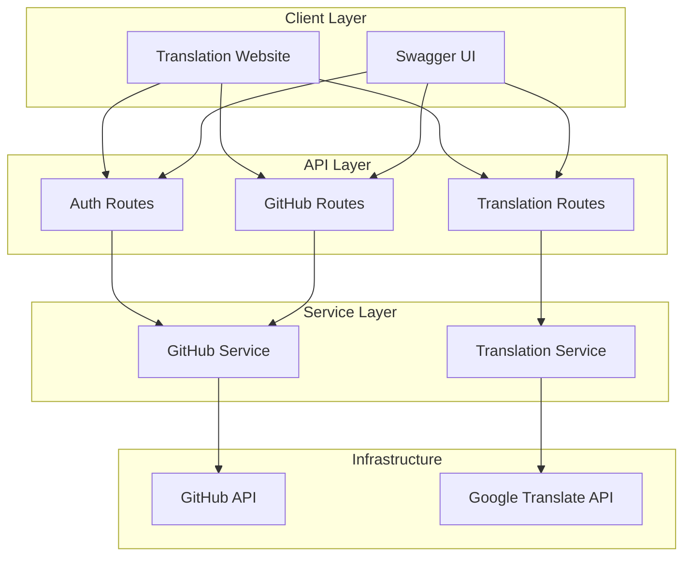
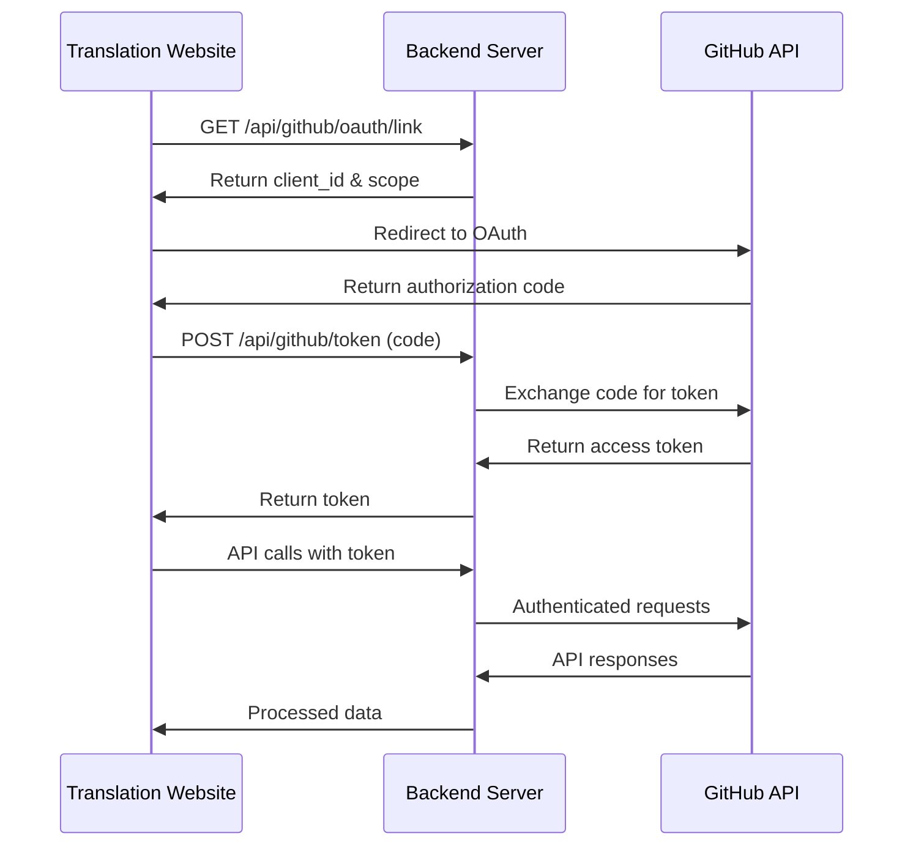
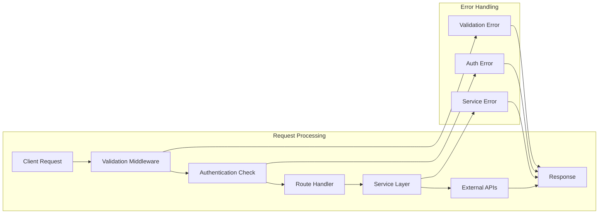

# Marine Term Translations - Backend Server

A modern Node.js backend server that connects a term translation website with GitHub repositories for collaborative translation management. This server provides RESTful APIs for GitHub integration, file management, translation services, and collaborative review workflows.

## 🚀 Overview

This backend server enables seamless integration between translation websites and GitHub repositories (see [Demo_Repo_Translate_Term](https://github.com/marine-term-translations/Demo_Repo_Translate_Term)). Built with Express.js and following SOLID principles, it provides a robust foundation for managing translations, pull requests, and collaborative reviews.

### Key Features

- **GitHub Integration**: OAuth authentication, repository management, and pull request workflows
- **Translation Management**: YAML file parsing, conflict detection, and translation suggestions
- **Collaborative Reviews**: Approval workflows with designated reviewers
- **API Documentation**: Comprehensive Swagger/OpenAPI documentation
- **Docker Support**: Containerized deployment with Docker Compose

## 🏗️ Project Architecture



## 📁 Project Structure

```
Node-Back-End/
├── 📁 config/
│   └── app.js                 # Application configuration and setup
├── 📁 middleware/
│   └── validation.js          # Request validation middleware
├── 📁 routes/
│   ├── auth.js                # GitHub OAuth authentication routes
│   ├── github.js              # GitHub API integration routes
│   └── translation.js         # Translation service routes
├── 📁 services/
│   ├── githubService.js       # GitHub API business logic
│   └── translationService.js  # Translation business logic
├── 📁 utils/
│   └── constants.js           # Application constants and configurations
├── 📁 proxy/                  # Nginx proxy configuration
├── server.js                  # Main application entry point
├── server-original.js         # Legacy server implementation
├── swagger.js                 # Swagger documentation generator
├── swagger_output.json        # Generated API documentation
├── reviewers.json             # Authorized reviewers configuration
├── docker-compose.yml         # Docker composition
├── Dockerfile                 # Container definition
└── package.json               # Project dependencies and scripts
```

### Directory Responsibilities

| Directory | Purpose | Key Components |
|-----------|---------|----------------|
| `config/` | Application configuration | Express app setup, middleware configuration, route mounting |
| `routes/` | API endpoint definitions | Route handlers, parameter validation, response formatting |
| `services/` | Business logic implementation | GitHub API interactions, translation processing |
| `middleware/` | Request processing | Authentication, validation, error handling |
| `utils/` | Shared utilities | Constants, helper functions, configuration |

## 🔧 Code Conventions

### General Guidelines

- **ES6 Modules**: Use `import/export` syntax
- **Async/Await**: Prefer async/await over Promises and callbacks
- **Error Handling**: Consistent error response format with status codes
- **Validation**: All inputs validated using middleware
- **Documentation**: JSDoc comments for all functions and classes

### Naming Conventions

```javascript
// File names: camelCase
githubService.js
translationService.js

// Variable names: camelCase
const githubToken = req.headers.authorization;
const branchName = req.query.branch;

// Function names: camelCase
async function getBranches(repo) { }
async function validateGitHubToken(req, res, next) { }

// Class names: PascalCase
class GitHubService { }
class TranslationService { }

// Constants: UPPER_SNAKE_CASE
const STATUS_CODES = { OK: 200, BAD_REQUEST: 400 };
const ERROR_MESSAGES = { UNAUTHORIZED: "Token required" };
```

### Code Structure Patterns

#### Route Handler Pattern
```javascript
router.get("/endpoint",
  validateGitHubToken,              // Authentication middleware
  validateQueryParams(['param']),   // Validation middleware
  validateGitHubOwner,             // Authorization middleware
  async (req, res) => {            // Route handler
    try {
      const service = new Service(token);
      const result = await service.method(params);
      res.json(result);
    } catch (error) {
      console.error("Error description:", error);
      res.status(STATUS_CODES.INTERNAL_SERVER_ERROR).json({
        error: "Error Type",
        message: ERROR_MESSAGES.RELEVANT_MESSAGE,
      });
    }
  }
);
```

#### Service Class Pattern
```javascript
export class ServiceName {
  constructor(token) {
    this.octokit = new Octokit({ auth: token });
    this.owner = process.env.GITHUB_OWNER;
  }

  async methodName(params) {
    // Implementation with proper error handling
    try {
      const response = await this.octokit.request(/* ... */);
      return response.data;
    } catch (error) {
      console.error("Specific error context:", error);
      throw new Error("Descriptive error message");
    }
  }
}
```

#### Validation Middleware Pattern
```javascript
export const validateSomething = (requirements) => {
  return (req, res, next) => {
    // Validation logic
    if (!isValid) {
      return res.status(STATUS_CODES.BAD_REQUEST).json({
        error: "Bad Request",
        message: ERROR_MESSAGES.SPECIFIC_ERROR,
      });
    }
    next();
  };
};
```

### Environment Variables

All environment variables should be documented and have fallback values where appropriate:

```javascript
// Required environment variables
GITHUB_CLIENT_ID=your_github_client_id
GITHUB_CLIENT_SECRET=your_github_client_secret
GITHUB_OWNER=repository_owner
GITHUB_KEY_BRANCH=branch_prefix
DOMAIN_NAME=your_domain
```

## 🚦 Authentication Flow



## 🛠️ Getting Started

### Prerequisites

Ensure you have the following installed:

- **Node.js v20.15.0+** - [Download](https://nodejs.org/)
- **Docker & Docker Compose** - [Installation Guide](https://docs.docker.com/get-docker/)
- **Git** - [Installation Guide](https://git-scm.com/downloads)

### Environment Setup

1. **Clone the Repository**
   ```bash
   git clone https://github.com/marine-term-translations/Node-Back-End.git
   cd Node-Back-End
   ```

2. **Environment Configuration**
   
   Create a `.env` file with the following variables:
   ```bash
   # GitHub OAuth Configuration
   GITHUB_CLIENT_ID=your_github_client_id
   GITHUB_CLIENT_SECRET=your_github_client_secret
   
   # Repository Configuration  
   GITHUB_OWNER=your_github_username_or_org
   GITHUB_KEY_BRANCH=your_branch_prefix
   
   # Server Configuration
   DOMAIN_NAME=your_domain_or_localhost
   PORT=5000
   ```

3. **Install Dependencies**
   ```bash
   npm install
   ```

### Development Workflow

#### Local Development
```bash
# Start the development server
npm run server

# Generate Swagger documentation
npm run swagger

# Access the application
# API: http://localhost:5000
# Documentation: http://localhost:5000/docs
```

#### Docker Development
```bash
# Build and start services
docker-compose up -d

# View logs
docker-compose logs -f

# Stop services
docker-compose down
```

#### Testing API Endpoints
```bash
# Test OAuth link generation
curl http://localhost:5000/api/github/oauth/link

# Test with authorization token
curl -H "Authorization: your_token" \
     "http://localhost:5000/api/github/branches?repo=your_repo"
```

### Production Deployment

1. **Build Docker Image**
   ```bash
   docker-compose build
   ```

2. **Deploy with Docker Compose**
   ```bash
   docker-compose up -d
   ```

3. **Verify Deployment**
   ```bash
   # Health check
   curl https://your-domain:5000/api/github/oauth/link
   
   # Access documentation
   https://your-domain:5000/docs
   ```

## 📚 API Documentation

### API Overview

The server provides three main API groups:

- **`/api/github/*`** - GitHub integration and repository management
- **`/api/translation/*`** - Translation services and suggestions  
- **`/docs`** - Interactive Swagger documentation

### Authentication

Most endpoints require GitHub OAuth token authentication:

```http
Authorization: your_github_oauth_token
```

### Core Endpoints

#### GitHub Authentication

| Method | Endpoint | Description |
|--------|----------|-------------|
| `GET` | `/api/github/oauth/link` | Get GitHub OAuth authorization link |
| `POST` | `/api/github/token` | Exchange OAuth code for access token |

#### Repository Management

| Method | Endpoint | Description |
|--------|----------|-------------|
| `GET` | `/api/github/branches` | List repository branches |
| `GET` | `/api/github/tree` | Get YAML files from repository |
| `GET` | `/api/github/content` | Get file content |
| `GET` | `/api/github/diff` | Compare branches |
| `GET` | `/api/github/conflicts` | Detect translation conflicts |

#### Translation Workflows

| Method | Endpoint | Description |
|--------|----------|-------------|
| `PUT` | `/api/github/update` | Update translation files |
| `GET` | `/api/github/changed` | Get changed files in PR |
| `PUT` | `/api/github/merge` | Merge pull request |
| `POST` | `/api/github/comment` | Add PR comment |

#### Review System

| Method | Endpoint | Description |
|--------|----------|-------------|
| `GET` | `/api/github/pr/:prNumber/file/:filePath/approved` | Check file approval |
| `POST` | `/api/github/pr/:prNumber/file/:filePath/approve` | Approve file |

#### Translation Services

| Method | Endpoint | Description |
|--------|----------|-------------|
| `POST` | `/api/translation/suggestions` | Get translation suggestions |

### Request/Response Flow



### Response Format Standards

All API responses follow consistent patterns:

#### Success Response
```json
{
  "data": {},           // Response payload
  "status": "success"   // Status indicator
}
```

#### Error Response
```json
{
  "error": "Error Type",
  "message": "Descriptive error message",
  "status": "error"
}
```

#### Status Codes
- `200` - Success
- `204` - No Content
- `400` - Bad Request (validation errors)
- `401` - Unauthorized (missing/invalid token)
- `404` - Not Found
- `500` - Internal Server Error
- `504` - Gateway Timeout

## 🤝 Contributing

### Development Setup

1. Fork the repository
2. Create a feature branch: `git checkout -b feature/your-feature`
3. Follow the code conventions outlined above
4. Test your changes thoroughly
5. Submit a pull request

### Pull Request Guidelines

- Use descriptive commit messages
- Include tests for new functionality
- Update documentation as needed
- Follow existing code style and patterns
- Ensure all tests pass

### Code Review Process

All changes go through a review process:

1. Automated checks (linting, tests)
2. Peer code review
3. Integration testing
4. Approval from designated reviewers (see `reviewers.json`)

## 📝 Swagger Documentation

Interactive API documentation is available at `/docs` when the server is running. The documentation is automatically generated from code annotations and provides:

- Complete endpoint documentation
- Request/response schemas
- Authentication requirements
- Interactive testing interface

To regenerate documentation:
```bash
npm run swagger
```

## 🐳 Docker Configuration

The application includes comprehensive Docker support:

### Docker Compose Services

- **Backend Server**: Main Node.js application
- **Nginx Proxy**: Reverse proxy for production deployment

### Container Configuration

```yaml
# Key Docker Compose configuration
version: '3.8'
services:
  backend:
    build: .
    ports:
      - "5000:5000"
    environment:
      - NODE_ENV=production
    volumes:
      - ./logs:/app/logs
```

## 🔧 Troubleshooting

### Common Issues

#### Environment Variables Not Set
```bash
# Verify environment variables
echo $GITHUB_CLIENT_ID
echo $GITHUB_OWNER
```

#### Port Already in Use
```bash
# Check port usage
lsof -i :5000

# Kill process
kill -9 <PID>
```

#### Docker Issues
```bash
# Reset Docker environment
docker-compose down
docker-compose build --no-cache
docker-compose up -d
```

### Debug Mode

Enable debug logging:
```javascript
// In your .env file
DEBUG=app:*
LOG_LEVEL=debug
```

## 📄 License

This project is licensed under the ISC License - see the [LICENSE](LICENSE) file for details.

## 🙏 Acknowledgments

- **Original Author**: Maxime ALBERT for VLIZ
- **Contributors**: Marine term translation community
- **Technologies**: Express.js, Octokit, GitHub API, Google Translate API
